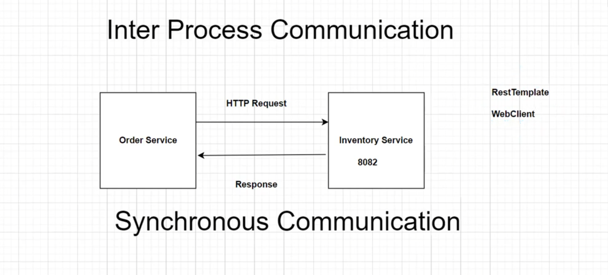
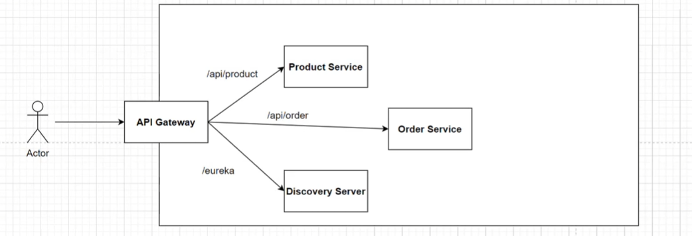
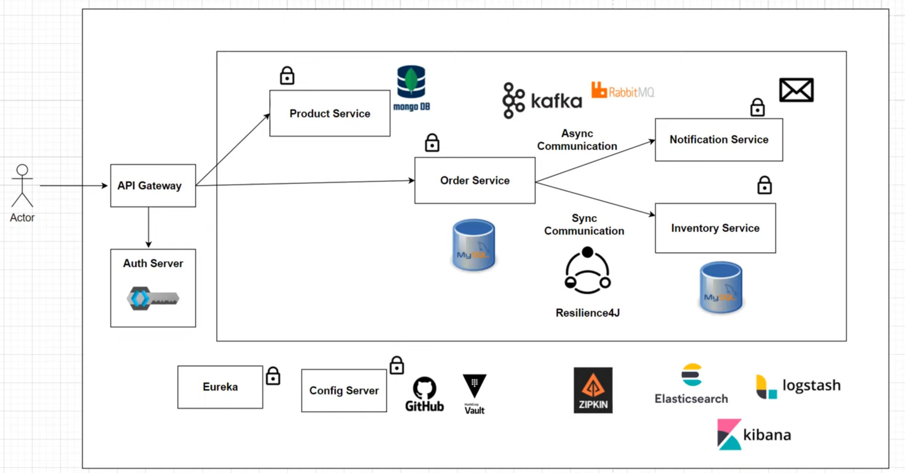

# ServiceView - Enterprise E-Commerce Microservices Platform

## Overview

ServiceView is a production-style enterprise e-commerce platform built using Spring Boot Microservices architecture. The project demonstrates scalable backend system design with synchronous and asynchronous communication, API Gateway routing, distributed authentication, event-driven architecture, resilience patterns, and centralized observability.

The system is designed to simulate real-world enterprise backend infrastructure using technologies commonly adopted in modern distributed systems.

---

# Architecture

## Basic Microservice Communication

Synchronous communication between services is implemented using HTTP-based inter-service calls with RestTemplate/WebClient.




---

## API Gateway and Service Discovery

The system uses API Gateway for centralized routing and Eureka Server for service discovery.





---

## Complete Enterprise Architecture

The platform integrates authentication, distributed communication, Kafka-based messaging, centralized configuration, resilience patterns, and observability tools.





---

# Features

## Authentication & Authorization

- JWT-based authentication
- Role-based access control
- Secure API Gateway authorization
- Protected microservices

## Product Management

- Create and manage products
- Dynamic inventory updates
- Product filtering
- Inventory synchronization

## Order Management

- Place orders
- Order history tracking
- Real-time stock validation
- Distributed transaction handling

## Event-Driven Communication

- Kafka-based asynchronous messaging
- Notification service integration
- Decoupled service communication

## Resilience & Reliability

- Resilience4J integration
- Circuit Breaker pattern
- Fault tolerance handling
- Retry mechanisms

## Observability & Monitoring

- Distributed tracing using Zipkin
- Centralized logging with ELK Stack
- Request tracking across services

## Cloud-Native Concepts

- API Gateway
- Service Discovery
- Config Server
- Centralized configuration management
- Containerized architecture using Docker

---

# Tech Stack

## Backend

- Java
- Spring Boot
- Spring Security
- Spring Cloud
- Spring Data JPA
- Spring WebFlux
- Hibernate

## Microservice Infrastructure

- Eureka Discovery Server
- API Gateway
- Config Server
- Resilience4J

## Databases

- MySQL
- MongoDB

## Messaging

- Apache Kafka

## Monitoring & Logging

- Zipkin
- Elasticsearch
- Logstash
- Kibana

## DevOps & Tools

- Docker
- Maven
- GitHub
- Postman

---

# Microservices

| Service              | Responsibility                         |
| -------------------- | -------------------------------------- |
| API Gateway          | Centralized routing and authentication |
| Auth Service         | JWT authentication and authorization   |
| Product Service      | Product management and catalog         |
| Inventory Service    | Inventory and stock handling           |
| Order Service        | Order processing                       |
| Notification Service | Event-driven notifications             |
| Eureka Server        | Service discovery                      |
| Config Server        | Centralized configuration              |

---

# Communication Patterns

## Synchronous Communication

Used for:

- Inventory validation
- Immediate stock checks
- Service-to-service HTTP requests

Technologies:

- RestTemplate
- WebClient

---

## Asynchronous Communication

Used for:

- Notifications
- Event publishing
- Decoupled service workflows

Technologies:

- Apache Kafka

---

# Security

- JWT Authentication
- API Gateway Security
- Role-Based Authorization
- Protected Endpoints
- Secure Service Communication

---

# Observability

## Distributed Tracing

- Zipkin integration for request tracing across services

## Centralized Logging

- Elasticsearch
- Logstash
- Kibana

---

# Resilience Patterns

- Circuit Breaker
- Retry Mechanism
- Fault Tolerance
- Graceful Failure Handling

Implemented using:

- Resilience4J

---

# Dockerized Setup

The project supports containerized deployment using Docker and Docker Compose.

Services can be started locally using:

```bash
docker-compose up --build
```

---

# Running the Project

## Prerequisites

- Java 17+
- Maven
- Docker
- MySQL
- MongoDB
- Kafka

---

## Clone Repository

```bash
git clone https://github.com/your-username/ServiceView.git
cd ServiceView
```

---

## Build Services

```bash
mvn clean install
```

---

## Start Infrastructure

Start:

- Kafka
- MySQL
- MongoDB
- Zipkin
- ELK Stack

---

## Run Services

Start services in the following order:

1. Eureka Server
2. Config Server
3. API Gateway
4. Auth Service
5. Product Service
6. Inventory Service
7. Order Service
8. Notification Service

---

# API Routes

| Endpoint            | Description         |
| ------------------- | ------------------- |
| `/api/auth/**`      | Authentication APIs |
| `/api/product/**`   | Product APIs        |
| `/api/order/**`     | Order APIs          |
| `/api/inventory/**` | Inventory APIs      |

---

# Project Highlights

- Enterprise-grade microservice architecture
- Event-driven communication using Kafka
- Distributed system concepts
- Production-style backend design
- Fault tolerance and resilience handling
- Centralized monitoring and tracing
- Secure API Gateway architecture
- Dockerized environment

---

# Deployment Note

This project is primarily designed as a local/containerized enterprise microservice system due to infrastructure requirements such as Kafka clusters, multiple databases, and distributed monitoring tools.

The architecture and services are fully production-oriented and can be deployed to cloud infrastructure with appropriate managed services.

---

# Future Enhancements

- Kubernetes deployment
- CI/CD pipeline integration
- Observability 
- Payment gateway integration
- Advanced analytics dashboard

---

# Author

Deep Vaishnav

Computer Engineering Student
Backend Developer | Microservices | Distributed Systems | Java & Spring Boot Enthusiast
